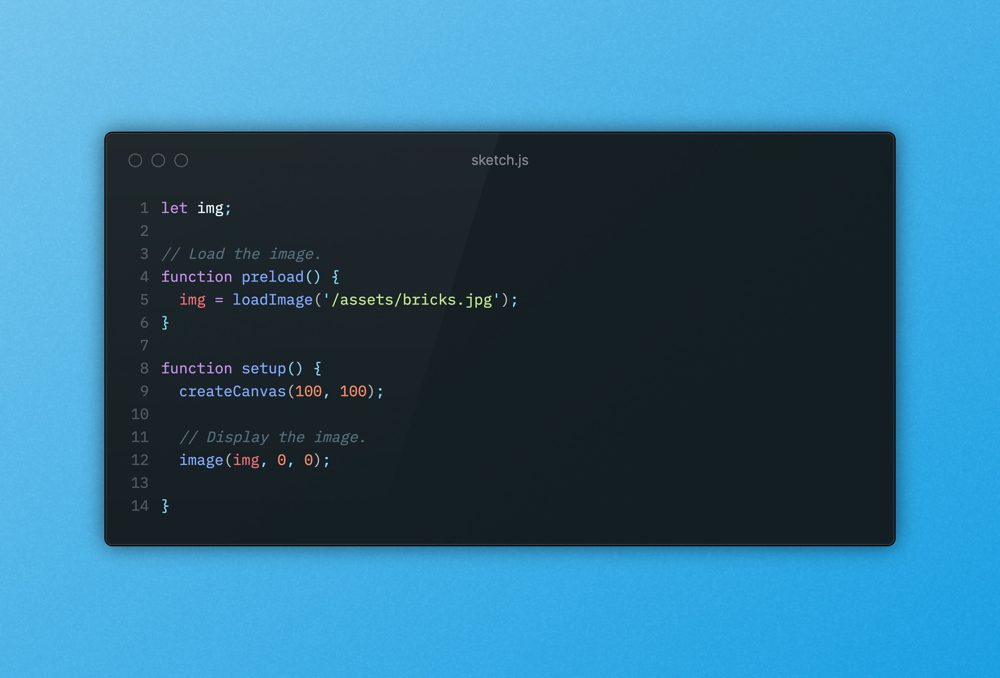

# T1 - creative coding: web tool - 3Web

## 1. L'idée
- images en cercle
- shapes/formes
- angles
- couleurs
- [Référence](https://www.instagram.com/p/DNSTsb_tlqB/?img_index=1)

## 2. Description de l'outil
L'outil sert à placer de façon aléatoire des images circulaires avec un clic de souris dans la page. Chaque images est reliée par un trait qui ferme la forme globale.
L'utilisateu.rice peut changer la couleur de fond de la forme.

Si possible à ajouter :
- changer l'épaisseur des traits
- enlever la couleur des traits
- modifier la taille des images circulaires
- déplacer les images avec un glisser-déposer

## 3. Les snippets

Découpage des bouts de code pour le projet (fonctionnalités) :

- placer des images au clic par rapport à l'emplacement de la souris
- relier les images avec un trait
- remplir une forme fermée d'une couleur (fill)
- changer la couleur de fond de la forme
- changer la taille d'une image

**Quelques snippets à tester :**

Afficher le canvas p5js de façon responsive dans la page
```
function setup() {
  createCanvas(windowWidth, windowHeight);
}

function draw() {
  background(0);
}

function windowResized() {
  resizeCanvas(windowWidth, windowHeight);
}
```
**Afficher une image dans le canvas**


 