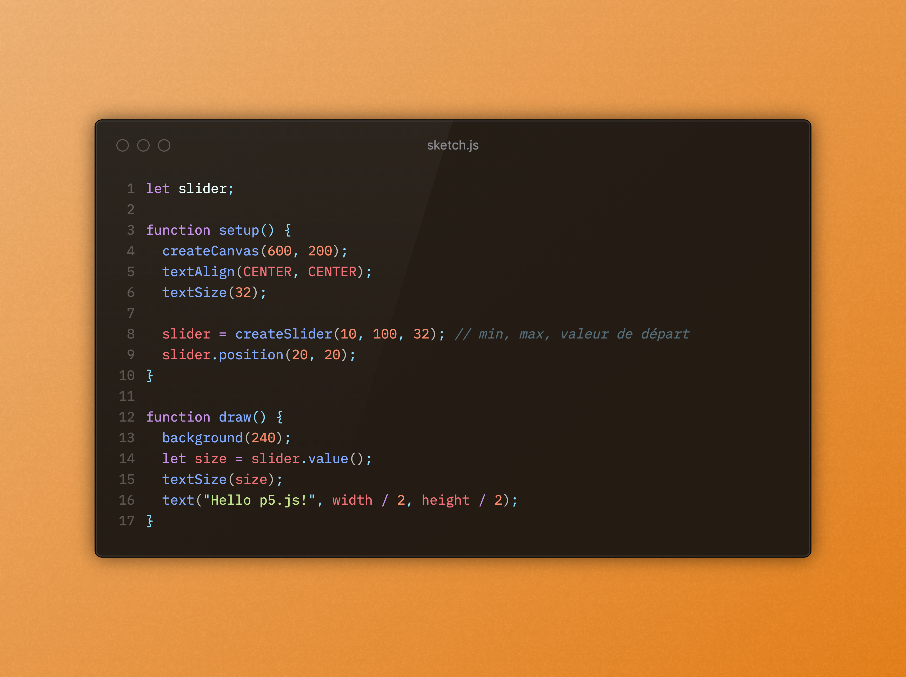

# T1 - creative coding: web tool - 3Web

## 1. L'idée
- images en cercle
- shapes/formes
- angles
- couleurs
- [Référence](https://www.instagram.com/p/DNSTsb_tlqB/?img_index=1)

## 2. Description de l'outil
L'outil sert à placer des images circulaires avec un clic de souris dans la page. Chaque images est reliée par un trait qui ferme la forme globale. L'utilisateur.rice peut changer la couleur de fond de la forme.

Si possible à ajouter :
- changer l'épaisseur des traits
- enlever les traits
- modifier la taille des images circulaires

## 3. Les snippets

Découpage des bouts de code pour le projet (fonctionnalités) :

- placer des images au clic par rapport à l'emplacement de la souris
- relier les images avec un trait
- remplir une forme fermée d'une couleur (fill)
- changer la couleur de fond de la forme
- changer la taille d'une image

**Quelques snippets à tester :**

Charger et afficher une image + appliquer un filtre
```
let img;

function preload() {
  img = loadImage("https://picsum.photos/400/300"); // image aléatoire
}

function setup() {
  createCanvas(600, 400);
}

function draw() {
  background(220);
  image(img, 0, 0, width, height);
  filter(GRAY); // essaie aussi: INVERT, THRESHOLD, BLUR
}
```
**Interface : slider pour modifier la taille d’un texte**


 